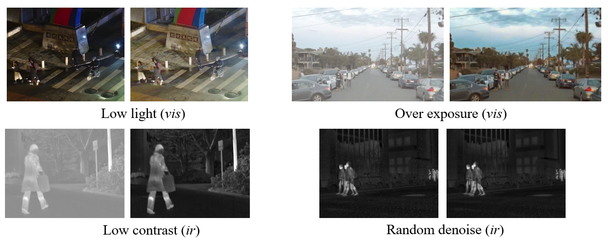
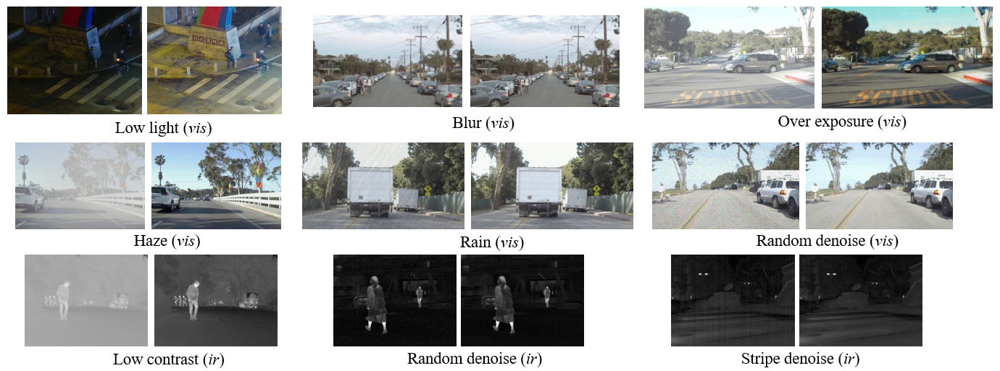

# EMS Dataset: Enhanced Multi-Spectral Various Scenarios for Degradation-Aware Image Fusion

Recently, researchers have actively carried out research on enhanced image fusion involving degradation perception. We construct a fusion dataset benchmark with multiple degradation types on exist dataset, which implicates multiple explicit degradations on the sources images. 

We construct the Enhanced Multi-Spectral Various Scenarios Dataset for Degradation-Aware Image Fusion based on the original data of the [MFNet](https://www.mi.t.utokyo.ac.jp/static/projects/mil_multispectral/), [RoadScene](https://github.com/hanna-xu/RoadScene)/[FLIR_aligned](https://adas-dataset-v2.flirconservator.com/#downloadguide), and [LLVIP](https://github.com/bupt-ai-cz/LLVIP).

## EMS-Lite
EMS-Lite contains the low-quality and high-quality multi-spectral scenarios images along with the text prompts, enriching from the Text-IF dataset.
The low-quality and high-quality images are obtained by the simulation and manual restoration or image restoration methods. 
The degradation types include the low light and overexposure in visible images, low contrast and noise in infrared images. 

The EMS-Lite dataset (with text) is now available at [Google Drive](https://drive.google.com/file/d/166nrgrWFhUvp917E6WKRIJghN7-u8TGj/view?usp=sharing).
### Gallery


## EMS-Full
EMS-Full contains the low-quality and high-quality multi-spectral scenarios images. The degradation types are more diverse, and challenging.
The degradation types include the low light, overexposure, rain, haze, blur and random noise in visible images, low contrast, stripe noise and random noise in infrared images. 

The EMS-Full dataset is ready to be available pending the final verification. 
The EMS-Full dataset will be available at here (to be done).
### Gallery


## Citation
If you use the dataset or our restored/degraded images, please cite our paper:
```
@inproceedings{yi2024text,
  title={Text-IF: Leveraging Semantic Text Guidance for Degradation-Aware and Interactive Image Fusion},
  author={Yi, Xunpeng and Xu, Han and Zhang, Hao and Tang, Linfeng and Ma, Jiayi},
  booktitle={Proceedings of the IEEE/CVF Conference on Computer Vision and Pattern Recognition},
  pages={27026--27035},
  year={2024}
}
```

Consider that EMS dataset is not a dataset with completely new images, but focuses on degradation and enhancement image fusion. 
We fully respect the copyright and contributions of the original authors. The original authors have full exclusive rights over their source data. 
Therefore, we also require that the researchers cite the paper corresponding to the original data:
```
@inproceedings{ha2017mfnet,
  title={MFNet: Towards real-time semantic segmentation for autonomous vehicles with multi-spectral scenes},
  author={Ha, Qishen and Watanabe, Kohei and Karasawa, Takumi and Ushiku, Yoshitaka and Harada, Tatsuya},
  booktitle={IEEE/RSJ International Conference on Intelligent Robots and Systems (IROS)},
  pages={5108--5115},
  year={2017},
  organization={IEEE}
}

@article{xu2020u2fusion,
  title={U2Fusion: A unified unsupervised image fusion network},
  author={Xu, Han and Ma, Jiayi and Jiang, Junjun and Guo, Xiaojie and Ling, Haibin},
  journal={IEEE Transactions on Pattern Analysis and Machine Intelligence (TPAMI)},
  volume={44},
  number={1},
  pages={502--518},
  year={2020},
  publisher={IEEE}
}

@inproceedings{jia2021llvip,
  title={LLVIP: A visible-infrared paired dataset for low-light vision},
  author={Jia, Xinyu and Zhu, Chuang and Li, Minzhen and Tang, Wenqi and Zhou, Wenli},
  booktitle={Proceedings of the IEEE/CVF International Conference on Computer Vision (ICCV)},
  pages={3496--3504},
  year={2021}
}
```

Please follow also their licence. Here, we express our thanks to them. 
If you are the author of the above dataset and would like to have your original data removed from EMS dataset, please email xpyi2008@163.com at any time.